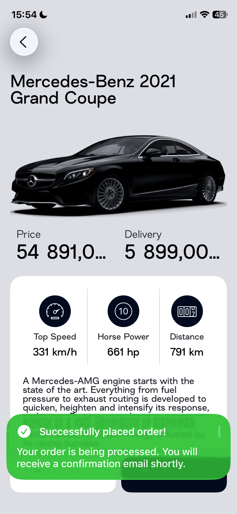

# 👑 Crown Motors — The Car Catalog App That Feels Like Magic! 🚗✨


Welcome to **Crown Motors**, a beautifully crafted iOS app that brings the joy of exploring, filtering, and discovering cars right to your fingertips. Built using the latest SwiftUI and UIKit techniques, this app combines sleek design with powerhouse functionality — designed to impress users *and* developers alike!

---

## Why Crown Motors? 💡

Imagine a car catalog app that’s both intuitive **and** delightful:  
- Browse a rich **interactive map** with real-time car locations powered by **YandexMapsMobile**.  
- Easily filter and search cars by price, model, and more — all with lightning-fast responsiveness.  
- Dive into **Instagram-style stories** showcasing cars in action, presented with smooth video playback and elegant navigation.  
- Get notified with custom, glass-effect banners that feel modern and polished.  
- Track your orders seamlessly with a dedicated order list that’s always up-to-date.

---

## 🚀 Major Features at a Glance

- **Interactive Car Map:** Explore cars plotted on an interactive map using the powerful **YandexMapsMobile SDK**. Pinch, zoom, and tap to see details right where it matters.  
- **Advanced Filters & Search:** Filter cars by price range and text search with immediate results, backed by efficient in-memory models and persistent **Core Data** storage.  
- **Instagram-like Stories:** Watch enticing car stories powered by **AVKit** and enhanced with smooth **Combine**-driven playback logic.  
- **Custom Notification Banners:** UIKit-based notifications featuring stunning glass effects, expand/collapse behavior, and subtle haptic feedback — designed to keep users engaged without distraction.  
- **Robust Order Management:** Keep track of your car orders with an intuitive list that updates dynamically.  
- **Seamless SwiftUI & UIKit Integration:** Best of both worlds — SwiftUI for fluid modern UI, UIKit for powerful custom views and notifications.  

---

## 🏗 Architecture & Development Highlights

- **MVVM (Model-View-ViewModel):** Clean separation of concerns keeps the codebase scalable and testable.  
- **Dependency Injection:** Makes local storage and services modular and easy to swap, boosting maintainability and test coverage.  
- **Core Data Integration:** Persistent storage layer for cars, orders, and user preferences — synchronized with UI effortlessly.  
- **Reactive Combine Framework:** Powers asynchronous data streams, especially in story playback and UI updates.  
- **AVKit Video Playback:** Smooth, native video experience for story content.  
- **Robust Unit Testing:** Comprehensive tests covering search, filters, and view models ensure rock-solid reliability.  

---

## 🎨 App Screenshots & Walkthrough

| **🔔 Custom Notification Banner** | |
|:----------------------------------------:|:----------------------------------------:|
|  |  |


## 🛠 Technology Stack

- **Languages & Frameworks:** Swift, SwiftUI, UIKit, Combine, AVKit  
- **Maps & Location:** YandexMapsMobile SDK for interactive car geolocation  
- **Data Persistence:** Core Data with modern syncing and mapping utilities  
- **Architecture:** MVVM with Dependency Injection for clean, testable code  
- **Notifications:** Custom UIKit views with glass effect, animations, and haptics  
- **Testing:** Xcode Unit Tests covering core business logic and UI components  
- **Tools:** Xcode 15+, Instruments for performance profiling, Git for version control  

---

## 📦 Getting Started

1. Clone the repository:  
   ```bash
   git clone https://github.com/palp1ix/Motors-Crown.git
